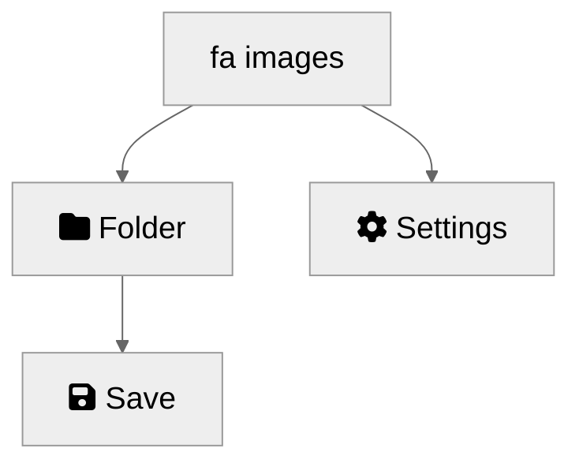

```mermaid
---
config:
  theme: neutral
  themeVariables:
    fontSize: 20px
---
graph TD
    root[fa images]
    root-->A["<i class='fas fa-folder'></i> Folder"] --> B["<i class='fas fa-save'></i> Save"]
    root--> C["<i class='fas fa-cog'></i> Settings"]
```
