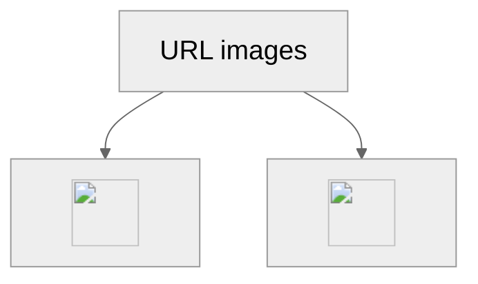

```mermaid
---
config:
  theme: neutral
  themeVariables:
    fontSize: 20px
---
graph TD
    root[URL images]
    root-->A["<img src='https://www.wikipedia.org/portal/wikipedia.org/assets/img/Wikipedia-logo-v2.png' width='50' height='50' />"]
    root-->B["<img src='https://www.mediawiki.org/static/images/icons/mediawikiwiki.svg' width='50' height='50' />"]
```
