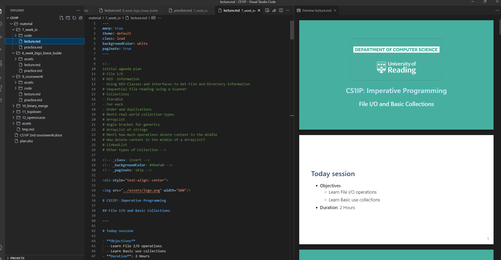

<!-- author: Alan Guedes <a.guedes@reading.ac.uk> -->

# Markdown-based presentation

The markdown system I used is called [Marp](https://marp.app/). I code it using VSCode and this [extension](https://marketplace.visualstudio.com/items?itemName=marp-team.marp-vscode).

## About some HTML extra features

To enable some HTML tags for better features (e.g. [mermaid](https://mermaid.js.org/intro/) for diagrams), you should enable it in VSCode preferences by
"markdown.marp.enableHtml": true
